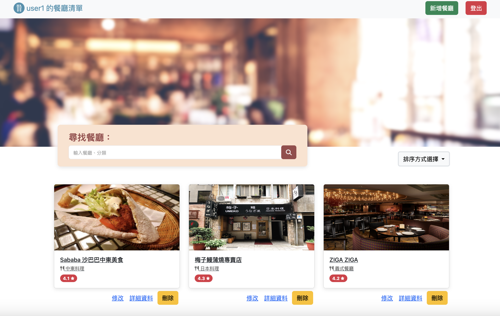

# 我的餐廳清單


## 介紹
註冊後可建立個人喜好的餐廳清單

### 功能
* 觀看建立過的餐廳資料
* 瀏覽餐廳詳細資料
* 在餐廳詳細資料內，可連結Google map查看地圖上的餐廳位置
* 搜尋您想找的餐廳 (店名或類別)
* 新增餐廳資料
* 編輯餐廳資料
* 刪除餐廳資料
* 註冊方式可使用 Facebook 登入


### 開始使用
1. 需有安裝 Node.js 以及 npm
2. 將此專案 clone 至本地
3. 從終端機進入此專案資料夾，輸入以下指令安裝套件
```
npm install
```
4. 安裝完畢後，請參照 .env.example 修改環境變數

5. 輸入以下指令啟動專案
```
npm run start
```
6. 若終端機顯示 "App is listening on localhost:3000" 則代表專案運行正常，請打開瀏覽器輸入以下網址
```
http://localhost:3000
```
7. 若需種子資料，可執行以下指令
```
npm run seed
```
8. 終止專案請於終端機輸入
```
ctrl + c
```

## 開發工具
- Node.js 18.16.0
- Express 4.18.2
- Express-Handlebars 3.0.0
- Bootstrap 5.3.0
- Font-Awesome 6.4.0
- Mongoose 7.4.1
- Passport.js 0.4.1
